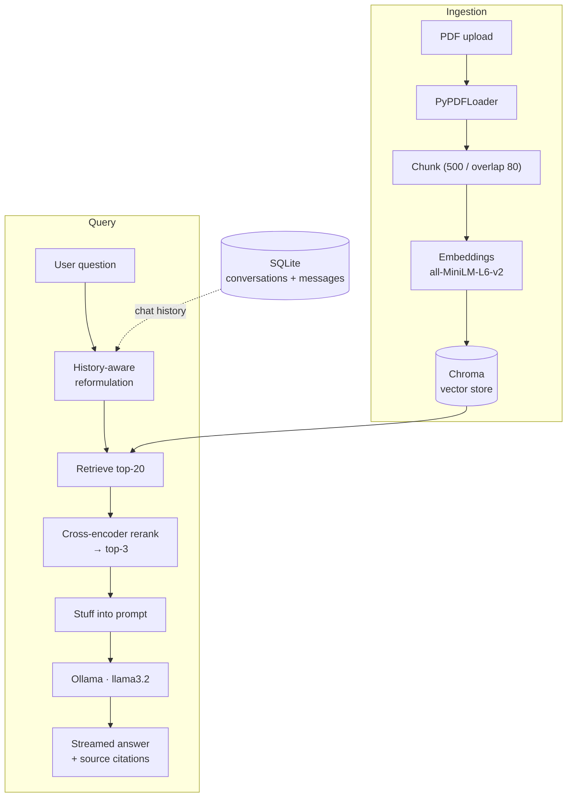

# 📄 Personal Document Q&A

A local, private **RAG (retrieval-augmented generation)** chatbot for your PDFs. Upload documents, and chat with them using a locally-running LLM — everything runs on your machine, no data leaves your device.

[](https://github.com/yxssrbj/Personal-RAG-system/actions/workflows/ci.yaml)


> Upload a PDF → ask a question → get a streamed, grounded answer with source citations.

---

## ✨ Features

- **Chat with your PDFs** — ask natural-language questions, get answers grounded in the documents.
- **Source citations** — every answer shows the source file and page it drew from.
- **Retrieve-then-rerank** — a cross-encoder reranks retrieved chunks for higher-precision context.
- **Streaming responses** — tokens render live as the model generates.
- **Multiple conversations** — persisted to SQLite, with **auto-generated titles**.
- **100% local** — LLM via [Ollama](https://ollama.com), embeddings via HuggingFace, vector store via Chroma. Nothing is sent to the cloud.

---

## 🏗️ Architecture



**Pipeline in words:** PDFs are chunked and embedded into a persistent Chroma store. On each question, the chat history is used to reformulate a standalone query, the top-20 chunks are retrieved, a cross-encoder reranks them down to the 3 most relevant, and those are passed as context to a local `llama3.2` model that streams a grounded answer with citations.

---

## 🚀 Run it

### With Docker (recommended)

Requires [Docker Desktop](https://www.docker.com/products/docker-desktop/). One command brings up the app **and** an Ollama server:

```bash
docker compose up --build
```

Then pull the model into the Ollama container (one-time — it persists in a volume):

```bash
docker compose exec ollama ollama pull llama3.2
```

Open **http://localhost:8501**, upload a PDF, and start asking questions.

### Locally (without Docker)

```bash
# create + activate a venv (Windows)
python -m venv .
Scripts\activate

# install dependencies
pip install -r requirements.txt

# start Ollama and pull the model (in a separate terminal)
ollama serve
ollama pull llama3.2

# run the app
streamlit run src/streamlit_app.py
```

---

## 🧠 Design decisions

The interesting engineering choices behind the app:

### Retrieve-then-rerank
Pure vector similarity is fast but imprecise. The app retrieves a **broad top-20** with the bi-encoder, then applies a **cross-encoder reranker** (`ms-marco-MiniLM-L6-v2`) to score each chunk against the query and keep only the **top-3**. This trades a little latency for noticeably more relevant context — the classic precision upgrade over naive similarity search.

### Buttons, not a radio, for conversation switching
The conversation switcher went through several rewrites. `st.radio` maintains a *committed selection* that Streamlit reconciles behind your back, and it can't be reliably driven programmatically while the user also drives it — creating a bug where sending a message silently loaded a *different* conversation. The fix was to model switching as an **event, not persistent state**: a button returns `True` only on the exact run it's clicked, so there's nothing for Streamlit to fight. Right tool for the interaction.

### A "functional core" for testability
Importing the Streamlit app runs the *entire* app (DB connection, Ollama health check, UI) — and drags in torch/chromadb, making a trivial test take 30+ seconds and depend on Ollama being up. Pure logic was extracted into [`src/rag_logic.py`](src/rag_logic.py) with **no Streamlit/DB/network side effects**, so tests import just that — running in **under a second** with zero external dependencies. Testability drove the design.

### CPU-only torch in the Docker image
Ollama does all the LLM inference; torch is only needed for CPU embeddings and reranking. The default `pip install torch` pulls **multi-GB CUDA libraries** the app never uses. Installing from the **CPU wheel index** cut the image from ~8 GB to **~3 GB** and sped up the build.

---

## ✅ Testing & CI

- **`pytest`** suite covering the pure logic (message conversion, role handling) and the Ollama health check (via mocking — no real network calls).
- **GitHub Actions** runs the suite on every push and pull request, in a clean environment with **no Ollama dependency** — thanks to the functional-core split.

```bash
pytest
```

---

## 🛠️ Tech stack

| Layer | Tool |
|---|---|
| UI | Streamlit |
| LLM | Ollama (`llama3.2`) |
| Orchestration | LangChain |
| Embeddings | HuggingFace `all-MiniLM-L6-v2` |
| Reranker | Cross-encoder `ms-marco-MiniLM-L6-v2` |
| Vector store | Chroma |
| Persistence | SQLite |
| Packaging | Docker Compose |
| CI | GitHub Actions + pytest |
